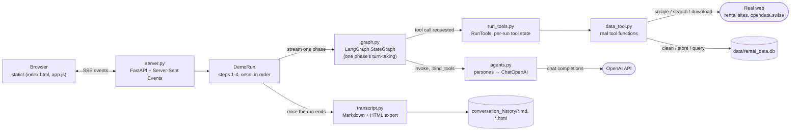
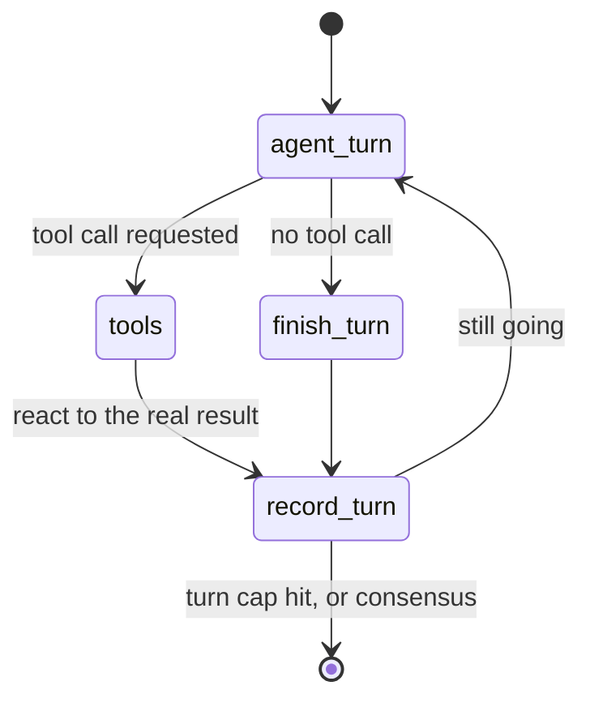

# Agentic Framework Demo: Data Analytics Process Model (LangGraph)

An experiment from the **Data Analytics** module at ZHAW: a
[LangGraph](https://langchain-ai.github.io/langgraph/)-based multi-agent
system wrapped in a live web app, used to explore how multiple LLM-based
agents can collaborate on a real data task. **Non-commercial / educational
use only.**

Three OpenAI-backed agents &mdash; a **Product Manager**, a **Data Analyst**,
and a **Data Engineer**, peers with no hierarchy between them &mdash; work
through the first steps of the course's Data Analytics Process Model:
agreeing on a business objective, defining what data is needed, actually
collecting it (real web scraping / open-data API calls), and preparing and
storing it (real cleaning, a real SQLite database, a real SQL query). No
analysis or modeling happens yet &mdash; that's a later part of the process
model this demo doesn't cover.

All agents share one growing conversation transcript, decide for themselves
whether and when to use their tools, and every number they discuss comes
from a real request, computation, or query &mdash; nothing is faked or
pre-scripted. A run ends automatically once the steps are done, or any time
via the **Stop** button.

## How it works

- **`graph.py`** &mdash; the LangGraph orchestration: a small compiled
  `StateGraph` that drives one agent's turn (speak &rarr; optionally call a
  real tool &rarr; react to the real result &rarr; record the turn), looped
  via a conditional edge until the phase's agents reach consensus (their
  status tag) or a turn cap is hit.
- **`agents.py`** &mdash; builds the six agent personas (a no-tools and a
  tools-bound variant of the Data Analyst and Data Engineer, plus the
  Product Manager), each a LangChain `ChatOpenAI`, `.bind_tools(...)`-ed
  where relevant.
- **`data_tool.py`** &mdash; the real tools the agents can call: scraping,
  open-data search/download, data profiling/cleaning, database storage, and
  a small sketching tool.
- **`run_tools.py`** &mdash; per-run state on top of `data_tool.py`'s pure
  functions: which file is "current" right now, and the real results each
  phase's result card needs to show.
- **`server.py`** &mdash; the FastAPI backend: a `DemoRun` runs the four
  steps in order, streaming each phase's compiled graph to the browser via
  Server-Sent Events.
- **`transcript.py`** &mdash; once a run ends, renders it to
  `conversation_history/` as both a Markdown transcript and a
  self-contained HTML page styled like the live chat (see Architecture
  below).
- **`static/`** &mdash; a plain HTML/CSS/JS frontend (no build step) that
  renders the conversation as a chat, with live progress and result cards.
- **`data/`** &mdash; where a run's real dataset files land: the downloaded
  dataset, the cleaned version, the SQLite database, and the fallback
  dataset if one was needed. Git-ignored (regenerated fresh every run).
- **`conversation_history/`** &mdash; every run's saved Markdown + HTML
  transcript. Git-ignored.

## Architecture

How the pieces fit together for one run:



And what `graph.py`'s compiled `StateGraph` actually does for a single
agent's turn, looped until the phase ends:



## Setup

1. Install dependencies (from the repo root): `pip install -r requirements.txt`
2. Create your `.env` file at the **repository root** from the provided
   template, then fill in your own key:
   ```console
   cp .env.example .env    # run from the repo root
   ```
   ```
   OPENAI_API_KEY=sk-...
   ```
   `.env` is already excluded via `.gitignore` &mdash; never commit your key.
3. From this folder, run the server:
   ```console
   python server.py
   ```
4. Open <http://localhost:8000> in your browser and click **Start
   conversation**. Click **Stop** at any point to end the run.

> [!NOTE]
> A full run makes real outbound HTTP requests, writes real local files
> (git-ignored), and consumes your OpenAI API credits for its duration —
> typically a few minutes.
