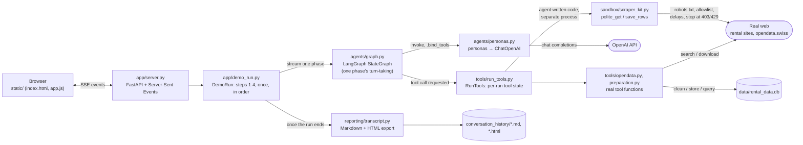
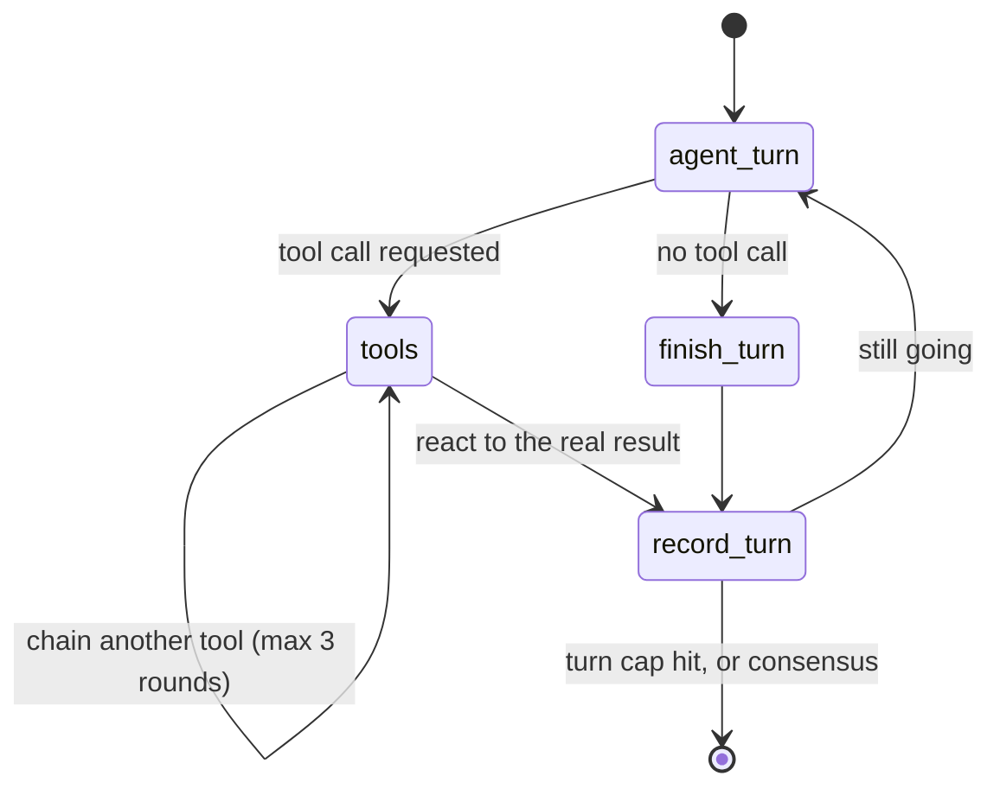

# Agentic Framework Demo: Data Analytics Process Model (LangGraph)

An experiment from the **Data Analytics** module at ZHAW: a
[LangGraph](https://langchain-ai.github.io/langgraph/)-based multi-agent
system wrapped in a live web app, used to explore how multiple LLM-based
agents can collaborate on a real data task. **Non-commercial / educational
use only.**

Three OpenAI-backed agents &mdash; a **Product Manager**, a **Data Analyst**,
and a **Data Engineer**, peers with no hierarchy between them &mdash; work
through the first steps of the course's Data Analytics Process Model:
agreeing on a business objective, defining what data is needed, actually
collecting it (real web scraping / open-data API calls), and preparing and
storing it (cleaning and enrichment code the agents write themselves, a
real SQLite database, a real SQL query). No
analysis or modeling happens yet &mdash; that's a later part of the process
model this demo doesn't cover.

All agents share one growing conversation transcript, decide for themselves
whether and when to use their tools, and every number they discuss comes
from a real request, computation, or query &mdash; nothing is faked or
pre-scripted. A run ends automatically once the steps are done, or any time
via the **Stop** button.

## How it works

```
main.py                  start the server: python main.py
app/
  config.py              run length, turn budgets, file paths, fallback dataset
  server.py              FastAPI routes + the Server-Sent-Events stream
  demo_run.py            DemoRun: steps 1-4 in order, stop/timeout handling
agents/
  prompts.py             every persona, phase goal and system message
  personas.py            builds the six agents (model + bound tools)
  graph.py               LangGraph StateGraph: one phase's turn-taking
tools/
  opendata.py            opendata.swiss search / download / discard
  preparation.py         preview, profile, SQLite store, SQL query, sketch
  scraper.py             check, save and run agent-written scrapers
  prep_code.py           check, save, run and judge agent-written cleaning/enrichment code
  teaching.py            show_to_class + look_up_past_runs (only when stuck)
  exhibits.py            real rows / one listing before-after / code excerpts
  history.py             what earlier runs did at a step, from saved transcripts
  walkthrough.py         how each new/changed column was derived (code, records, counts)
  sandbox.py             the code check + separate-process runner both share
  validation.py          "is this really listing-level data?" checks
  schemas.py             every tool schema the models see
  run_tools.py           RunTools: per-run state + tool dispatch
sandbox/scraper_kit.py   agent-written code's only way to the web
sandbox/prep_kit.py      agent-written prep code's only way to the data
reporting/transcript.py  saves each run as Markdown + HTML (+ teaching_cards.py, html_parts.py)
static/                  plain HTML/CSS/JS frontend (no build step)
tests/                   offline tests for the scraper and prep-code tools
```

- **`app/`** &mdash; the web layer. `config.py` holds every setting a run
  depends on (`DEMO_LENGTH_MINUTES` is the one knob for pacing).
  `demo_run.py`'s `DemoRun` runs the four steps in order, streaming each
  phase's compiled graph; `server.py` sends that to the browser via
  Server-Sent Events.
- **`agents/`** &mdash; `graph.py` is the LangGraph orchestration: a small
  compiled `StateGraph` that drives one agent's turn (speak &rarr;
  optionally call a real tool &rarr; react to the real result &rarr; record
  the turn), looped via a conditional edge until the phase's agents reach
  consensus (their status tag) or a turn cap is hit. `personas.py` builds
  the six agent variants (a no-tools and a tools-bound variant of the Data
  Analyst and Data Engineer, plus the Product Manager), each a LangChain
  `ChatOpenAI`, `.bind_tools(...)`-ed where relevant. All run on
  `gpt-4o-mini` except the tool-using Data Analyst, which writes and debugs
  real scraper code and uses `gpt-4.1` (`CODE_WRITING_MODEL`). All the
  wording they get lives in `prompts.py`.
- **`tools/`** &mdash; the real tools. `scraper.py` is the agent-written
  scraper: `write_scraper_code` (the Data Analyst hands in a complete Python
  script, statically checked and saved as `data/scrapers/scraper_vN.py`)
  and `run_scraper` (really runs it in a separate, time-limited process
  without your API key). `opendata.py` and `preparation.py` are the other
  real tools; `validation.py` rejects aggregated or half-empty datasets in
  code; `run_tools.py` adds per-run state on top (which file is "current",
  the real results each phase's result card shows).
- **`sandbox/scraper_kit.py`** &mdash; the scraper's only way to the web
  (see [Agent-written scraper](#agent-written-scraper) below). Kept outside
  the packages on purpose: the scraper process can import it, but none of
  the app's own code.
- **`reporting/transcript.py`** &mdash; once a run ends, renders it to
  `conversation_history/` as both a Markdown transcript and a
  self-contained HTML page styled like the live chat.
- **`data/`** &mdash; where a run's real dataset files land: the scraped or
  downloaded dataset, the cleaned and enriched versions, the SQLite
  database, the fallback dataset if one was needed, `data/scrapers/` (every
  scraper version the agent wrote plus each run's request log and output)
  and `data/prep/` (every cleaning/enrichment script version, same idea).
  Git-ignored (regenerated fresh every run).
- **`tests/`** &mdash; offline tests for the scraper and prep-code tools
  (`python -m unittest discover tests`, from this folder).
- **`conversation_history/`** &mdash; every run's saved Markdown + HTML
  transcript. Git-ignored.

## Architecture

How the pieces fit together for one run:



And what `agents/graph.py`'s compiled `StateGraph` actually does for a single
agent's turn, looped until the phase ends:



## Agent-written scraper

In Step 3 the Data Analyst writes its own scraper instead of calling a
ready-made one. It calls `write_scraper_code` with a complete Python
script, `run_scraper` to really run it, reads the real result (exit code,
traceback, every request with its HTTP status, rows saved), and fixes the
code if needed. Every version and every run appear in the chat as they
happen and are saved in the transcript.

**The rules are enforced in code, not in the prompt.** The script may only
import a short whitelist of modules (`scraper_kit`, `bs4`, `json`, `re`,
`urllib.parse`, ...), and its only way to the web is
`scraper_kit.polite_get(url)`, which:

- only fetches `flatfox.ch`, `immoscout24.ch` and `homegate.ch`
- checks `robots.txt` first (a 401/403 on robots.txt means "disallowed")
- waits 2&ndash;5 s between requests, at most 15 requests per run
- stops for good at the first 403, 429 or Cloudflare challenge &mdash; no
  retries, no workarounds &mdash; and uses an honest User-Agent

Results go through `scraper_kit.save_rows(...)` into a fixed column schema.
A run's output only becomes the dataset if it looks like individual
listings with the key fields (ID, rent, rooms, zip/city) at least 80%
filled; the agents then clean, enrich and store it (see below).

**Working memory.** Tool results only exist during the turn that called
the tool; the shared transcript keeps just each agent's one-sentence
reaction. So before every turn the tool-using Data Analyst gets private
notes on its last scraper run (error, real response structure, the code it
ran). Without them, a fix written on a later turn has to guess again.

**What to expect.** From a server, immoscout24.ch and homegate.ch answer
403 (bot protection), and the agents say so and move on. flatfox.ch
publishes a public JSON API (`/api/v1/public-listing/`) that its
`robots.txt` allows, and that's where live runs have ended up with real
listings (e.g. 63 Zürich-area rental apartments in one test run). The code
check and the separate process keep an LLM's code honest in a classroom
demo; they're not a hard security boundary, so don't expose this app
publicly. Check each site's terms of use before using its data.

## Agent-written cleaning & enrichment

Step 4 works the same way as the scraper, on the individual flatfox
listings collected in Step 3 (one row per apartment), in four phases:

1. **Planning** &mdash; all three agents see a briefing with the real
   collected columns, types, missing values and sample rows, and agree on
   what cleaning and which extra per-apartment information make sense.
2. **Cleaning** &mdash; the Data Engineer profiles the data, then writes
   its own pandas script (`write_prep_code`) and really runs it
   (`run_prep_code`); the Data Analyst reviews the code and the real
   before/after numbers.
3. **Enrichment** &mdash; the Data Analyst writes its own script that adds
   new columns to every apartment; the Data Engineer reviews it. Nothing
   is prescribed: the agents decide what to derive from existing columns
   (e.g. price per m², as in Week 3), what to extract from each listing's
   description and attributes (the scraper now also saves those), and
   whether to look up real information per apartment's coordinates via the
   federal geodata API (`api3.geo.admin.ch`: the municipality and its BFS
   number, or building-register data such as the construction year).
4. **Storing** &mdash; the Data Engineer stores the prepared table in
   SQLite and verifies it with a SQL query, as before.

**The rules are enforced in code, as for the scraper.** A prep script runs
in a separate, time-limited process (240 s) without your API key; it may
import only pandas, numpy, a few stdlib modules and the two sandbox kits.
It gets its input only via `prep_kit.load_data()` and hands back its
result via `prep_kit.save_data(df)` &mdash; pandas' own file readers and
writers (`read_*`, `to_csv`, ...) are rejected by the code check. Its only
way to the web is `scraper_kit.polite_get` again, here allowed for
`flatfox.ch` and `api3.geo.admin.ch` (robots.txt checked, 0.2&ndash;0.5 s
between geodata lookups, at most 300 requests per run, stop at the first
403/429). Every run's result is judged in code: listing_id must stay
unique, cleaning may drop at most half the rows, enrichment must keep
every row and add at least one column &mdash; otherwise the run is
rejected with the reason and the agent fixes its code. A missing rent is
never filled in (it's what the model will predict), and a run whose
lookups failed or whose new columns are mostly empty (a test on a few
rows) gets a diagnosis saying so. Each coder has private working notes on
its last run, like the scraper's author. On the aggregated fallback
dataset the enrichment phase is skipped.

**What everyone sees.** After every real script run (scraper or prep), a
one-line system note lands in the shared conversation ("Real run of
enrich_v2.py: exit code 0, 65 → 65 rows, new columns: municipality_name
(100% filled), ... — ACCEPTED"), so reviewers discuss what actually ran —
in live tests a reviewer otherwise described a run that never happened. A
phase also ends once two full rounds pass with mostly empty replies and no
tool use, and a reply without a status tag keeps the agent's earlier vote.

## Showing, not just telling

The app is meant for students to learn from, so the agents don't only
talk about results — they can put real examples in the chat with
`show_to_class` (tools/teaching.py, tools/exhibits.py):

- **one listing up close** — a single apartment field by field, as
  collected vs. after preparation, e.g. its description text next to the
  flags the enrichment derived from it (new values green, changed yellow)
- **real rows** — a few rows of the current dataset, chosen columns
- **code** — a few numbered lines of a script an agent wrote this run

Everything shown is read from the real files; the agent only picks what
to show and writes a one-sentence caption on what to notice. At most four
examples per phase.

**How each column was derived.** Whatever the agents choose to show, the
app itself adds a 📌 walkthrough right after every accepted cleaning and
enrichment run (tools/walkthrough.py). One feature at a time — chips switch
between `has_balcony`, `has_lift`, `municipality`, … — it shows:

- the count, e.g. "True for 41 of 54 listings (25 of them say so in the
  description) — decided by the words: balcony, balkon";
- the agents' own code, only the lines that produced that column (e.g.
  `'balcony': (['balkon', 'balcony'], …)` and the loop applying it), with
  one step of data flow (`muni_df = df.apply(… x['lat'], x['lon'] …)` for
  `municipality`);
- selected records: listings whose description really contains the word
  (marked), next to the new value, plus one without it for contrast — for
  a lookup, the inputs (lat/lon) next to the value it returned; for
  cleaning, before → after of rows that changed;
- a few listings with their inputs next to all new columns.

The evidence words come from the literals in the agents' script, on the
line that names the column, and are kept only if the data confirms them —
so it works for German text as well. Because it shows the real rule on
real records, it also exposes the rule's mistakes (e.g. "ohne Lift" → has_lift
= True). Code and data in the cards are shown in full (wrapped, never cut
off); a wide sample of a few rows is turned on its side.

**Help when stuck.** Only once a coding agent can't get further on its own
— its last two runs in a step failed, or its run budget is nearly used up
with nothing accepted — may it call `look_up_past_runs`: the script that
finally worked at the same step in earlier runs, and the problems those
runs hit, read from `conversation_history/*.md` (tools/history.py). Before
that the tool refuses, so every run first has to find its own way; when it
is used, a card in the chat says so.

## Setup

1. Install dependencies (from the repo root): `pip install -r requirements.txt`
2. Create your `.env` file at the **repository root** from the provided
   template, then fill in your own key:
   ```console
   cp .env.example .env    # run from the repo root
   ```
   ```
   OPENAI_API_KEY=sk-...
   ```
   `.env` is already excluded via `.gitignore` &mdash; never commit your key.
3. From this folder, run the server:
   ```console
   python main.py
   ```
4. Open <http://localhost:8000> in your browser and click **Start
   conversation**. Click **Stop** at any point to end the run.

> [!NOTE]
> A full run makes real outbound HTTP requests, writes real local files
> (git-ignored), and consumes your OpenAI API credits for its duration —
> typically a few minutes.
