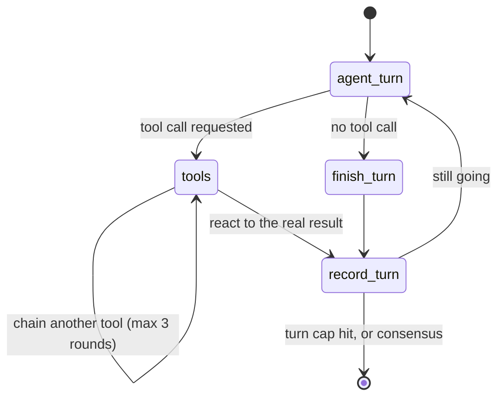

# Agentic Framework Demo: Data Analytics Process Model (LangGraph)

An experiment from the **Data Analytics** module at ZHAW: a
[LangGraph](https://langchain-ai.github.io/langgraph/)-based multi-agent
system wrapped in a live web app, used to explore how multiple LLM-based
agents can collaborate on a real data task. **Non-commercial / educational
use only.**

Three OpenAI-backed agents &mdash; a **Product Manager**, a **Data Analyst**,
and a **Data Engineer**, peers with no hierarchy between them &mdash; work
through the first steps of the course's Data Analytics Process Model:
agreeing on a business objective, defining what data is needed, actually
collecting it (real web scraping / open-data API calls), and preparing and
storing it (real cleaning, a real SQLite database, a real SQL query). No
analysis or modeling happens yet &mdash; that's a later part of the process
model this demo doesn't cover.

All agents share one growing conversation transcript, decide for themselves
whether and when to use their tools, and every number they discuss comes
from a real request, computation, or query &mdash; nothing is faked or
pre-scripted. A run ends automatically once the steps are done, or any time
via the **Stop** button.

## How it works

```
main.py                  start the server: python main.py
app/
  config.py              run length, turn budgets, file paths, fallback dataset
  server.py              FastAPI routes + the Server-Sent-Events stream
  demo_run.py            DemoRun: steps 1-4 in order, stop/timeout handling
agents/
  prompts.py             every persona, phase goal and system message
  personas.py            builds the six agents (model + bound tools)
  graph.py               LangGraph StateGraph: one phase's turn-taking
tools/
  opendata.py            opendata.swiss search / download / discard
  preparation.py         preview, profile, clean, SQLite store, SQL query, sketch
  scraper.py             check, save and run agent-written scrapers
  validation.py          "is this really listing-level data?" checks
  schemas.py             every tool schema the models see
  run_tools.py           RunTools: per-run state + tool dispatch
sandbox/scraper_kit.py   agent-written scrapers' only way to the web
reporting/transcript.py  saves each run as Markdown + HTML
static/                  plain HTML/CSS/JS frontend (no build step)
tests/                   offline tests for the scraper tools
```

- **`app/`** &mdash; the web layer. `config.py` holds every setting a run
  depends on (`DEMO_LENGTH_MINUTES` is the one knob for pacing).
  `demo_run.py`'s `DemoRun` runs the four steps in order, streaming each
  phase's compiled graph; `server.py` sends that to the browser via
  Server-Sent Events.
- **`agents/`** &mdash; `graph.py` is the LangGraph orchestration: a small
  compiled `StateGraph` that drives one agent's turn (speak &rarr;
  optionally call a real tool &rarr; react to the real result &rarr; record
  the turn), looped via a conditional edge until the phase's agents reach
  consensus (their status tag) or a turn cap is hit. `personas.py` builds
  the six agent variants (a no-tools and a tools-bound variant of the Data
  Analyst and Data Engineer, plus the Product Manager), each a LangChain
  `ChatOpenAI`, `.bind_tools(...)`-ed where relevant. All run on
  `gpt-4o-mini` except the tool-using Data Analyst, which writes and debugs
  real scraper code and uses `gpt-4.1` (`CODE_WRITING_MODEL`). All the
  wording they get lives in `prompts.py`.
- **`tools/`** &mdash; the real tools. `scraper.py` is the agent-written
  scraper: `write_scraper_code` (the Data Analyst hands in a complete Python
  script, statically checked and saved as `data/scrapers/scraper_vN.py`)
  and `run_scraper` (really runs it in a separate, time-limited process
  without your API key). `opendata.py` and `preparation.py` are the other
  real tools; `validation.py` rejects aggregated or half-empty datasets in
  code; `run_tools.py` adds per-run state on top (which file is "current",
  the real results each phase's result card shows).
- **`sandbox/scraper_kit.py`** &mdash; the scraper's only way to the web
  (see [Agent-written scraper](#agent-written-scraper) below). Kept outside
  the packages on purpose: the scraper process can import it, but none of
  the app's own code.
- **`reporting/transcript.py`** &mdash; once a run ends, renders it to
  `conversation_history/` as both a Markdown transcript and a
  self-contained HTML page styled like the live chat.
- **`data/`** &mdash; where a run's real dataset files land: the scraped or
  downloaded dataset, the cleaned version, the SQLite database, the
  fallback dataset if one was needed, and `data/scrapers/` (every scraper
  version the agent wrote plus each run's request log and output).
  Git-ignored (regenerated fresh every run).
- **`tests/`** &mdash; offline tests for the scraper tools
  (`python -m unittest discover tests`, from this folder).
- **`conversation_history/`** &mdash; every run's saved Markdown + HTML
  transcript. Git-ignored.

## Architecture

How the pieces fit together for one run:


And what `agents/graph.py`'s compiled `StateGraph` actually does for a single
agent's turn, looped until the phase ends:



## Agent-written scraper

In Step 3 the Data Analyst writes its own scraper instead of calling a
ready-made one. It calls `write_scraper_code` with a complete Python
script, `run_scraper` to really run it, reads the real result (exit code,
traceback, every request with its HTTP status, rows saved), and fixes the
code if needed. Every version and every run appear in the chat as they
happen and are saved in the transcript.

**The rules are enforced in code, not in the prompt.** The script may only
import a short whitelist of modules (`scraper_kit`, `bs4`, `json`, `re`,
`urllib.parse`, ...), and its only way to the web is
`scraper_kit.polite_get(url)`, which:

- only fetches `flatfox.ch`, `immoscout24.ch` and `homegate.ch`
- checks `robots.txt` first (a 401/403 on robots.txt means "disallowed")
- waits 2&ndash;5 s between requests, at most 15 requests per run
- stops for good at the first 403, 429 or Cloudflare challenge &mdash; no
  retries, no workarounds &mdash; and uses an honest User-Agent

Results go through `scraper_kit.save_rows(...)` into a fixed column schema.
A run's output only becomes the dataset if it looks like individual
listings with the key fields (ID, rent, rooms, zip/city) at least 80%
filled; the Data Engineer then cleans it and stores it in SQLite as usual.

**Working memory.** Tool results only exist during the turn that called
the tool; the shared transcript keeps just each agent's one-sentence
reaction. So before every turn the tool-using Data Analyst gets private
notes on its last scraper run (error, real response structure, the code it
ran). Without them, a fix written on a later turn has to guess again.

**What to expect.** From a server, immoscout24.ch and homegate.ch answer
403 (bot protection), and the agents say so and move on. flatfox.ch
publishes a public JSON API (`/api/v1/public-listing/`) that its
`robots.txt` allows, and that's where live runs have ended up with real
listings (e.g. 63 Zürich-area rental apartments in one test run). The code
check and the separate process keep an LLM's code honest in a classroom
demo; they're not a hard security boundary, so don't expose this app
publicly. Check each site's terms of use before using its data.

## Setup

1. Install dependencies (from the repo root): `pip install -r requirements.txt`
2. Create your `.env` file at the **repository root** from the provided
   template, then fill in your own key:
   ```console
   cp .env.example .env    # run from the repo root
   ```
   ```
   OPENAI_API_KEY=sk-...
   ```
   `.env` is already excluded via `.gitignore` &mdash; never commit your key.
3. From this folder, run the server:
   ```console
   python main.py
   ```
4. Open <http://localhost:8000> in your browser and click **Start
   conversation**. Click **Stop** at any point to end the run.

> [!NOTE]
> A full run makes real outbound HTTP requests, writes real local files
> (git-ignored), and consumes your OpenAI API credits for its duration —
> typically a few minutes.
