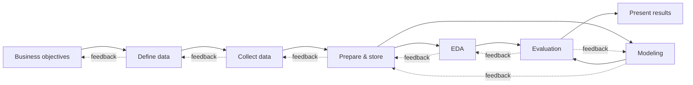

# Autonomous multi-agent data analytics (LangGraph + OpenAI + live web UI)

A team of LLM agents takes a business objective ("Build a price prediction model for rental apartments.")
from free text to a sourced, cleaned, analysed, modelled, evaluated and presented result. The web UI shows
every step live. Every hand-over passes a **gate**: deterministic checks, then a skeptical critic, then a
supervisor. Gates can send work back along the process model's feedback edges. A final model is scored
**once** on a locked holdout that no agent can read. An outer loop (`make improve`) benchmarks the system,
lets an ImproverAgent change prompts/tools/config, and keeps only changes that improve the score beyond noise.


Solid = forward, dotted = feedback (real conditional LangGraph edges). Every transition is decided by a gate; each
phase may also retry itself, and any phase may escalate to *Present results* (budget exhausted / no way forward).

## Architecture

```
frontend/  React + Vite + TS · React Flow (live graph) · Recharts · Tailwind
    │  REST /api/*  +  WebSocket /ws/runs/{id}  (tails the SQLite event log)
ada/api/server.py        FastAPI
ada/runner.py            start / resume / stop / approve; SqliteSaver checkpointer (resume after crash)
ada/graph/
  topology.py            the process model: nodes, forward + feedback edges, UI layout  (single source of truth)
  build.py               node wrapper: phase work → checks → critic → gate → supervisor → conditional edge
  phases.py              per-phase briefs, orchestrator post-processing (holdout lock, validation, MLflow, DuckDB, report)
  stub.py                scripted fake run (UI demo + tests, no LLM)
ada/gates/               deterministic checks + gate decision        ┐
ada/evaluation/          metrics, baselines, prediction harness      │ protected: the improver cannot edit these
ada/vault.py             locked holdout (hash split, strip, one-time)│
improve/ benchmarks/     self-improvement loop, scoring, tasks       ┘
ada/sandbox/             executor (docker | remote | subprocess-as-other-user), kit (ada_kit, sitecustomize guard)
ada/llm.py ada/budget.py OpenAI Responses API, per-call cost accounting, hard budget limits
agents/                  agents (prompt file + tool whitelist + Pydantic schema), critic, supervisor
agents/tools/            tools — editable by the improver
prompts/*.md             versioned system prompts — editable by the improver
config.yaml              models, budgets, gates, sandbox … (only models/roles/agents editable by the improver)
```

**Agents:** ObjectiveAgent, DataRequirementsAgent, DataCollectorAgent (the only one with network tools),
DataEngineerAgent, EDAAgent, ModelingAgent, EvaluationAgent, PresenterAgent, plus CriticAgent, Supervisor
and ImproverAgent. Each has a versioned prompt in `prompts/`, a fixed tool whitelist (`agents/phase_agents.py`)
and a Pydantic output schema (`ada/schemas.py`). Agents only get compact briefs plus artifact paths, never raw data.

**Gates** (`ada/gates/`): schema validation, row counts, null/duplicate rates, target sanity, leakage scan
(near-perfect correlation, target-derived names, identifiers, post-hoc columns), train/validation overlap,
"model must beat the naive baseline" (scored by the orchestrator, not the agent), claim/number consistency,
provenance + licences. Then the critic scores the work 0–10. Possible results: `pass | retry_same_phase |
route_back(<allowed node>) | escalate`. After 2 failed retries the same strategy may not be repeated.

**Locked holdout** — enforced by permissions and tool design, not by prompt: see
[DECISIONS.md](DECISIONS.md#holdout-and-isolation). Tests prove that agents' tools and sandboxed code cannot read it.

**Events:** every action is written to SQLite (`var/ada.db`) and streamed over WebSocket as
`{run_id, ts, node, agent, type, summary, payload}` with `type ∈ message | tool_call | tool_result | gate |
transition | artifact | metric | budget | error | improvement`.

## Run it

Requirement: a `.env` with `OPENAI_API_KEY`, either in this folder or in any parent folder. In this repository it
is in the repository root.

### Docker compose

```bash
docker compose up --build        # UI http://localhost:8080 · API :8000 · MLflow http://localhost:5000
```

The sandbox service mounts only the run workspaces, sits on an internal network without internet access, and
never sees the vault or `.env`.

### Local (no Docker; used for development here)

```bash
make setup          # .venv + requirements + npm install
make sandbox-user   # creates OS user 'adasandbox' that executes agent code (needs sudo); chmod 600 your .env
make run            # builds the UI, serves it + API on http://localhost:8000, MLflow UI on :5000
make demo           # scripted run without LLM calls (animates the UI)
make test           # unit tests, no LLM calls
make improve        # one self-improvement cycle
make bench          # benchmark suite once
```

CLI: `.venv/bin/python -m ada.cli run --objective "…" [--region Zurich] [--offline] [--max-usd 3]`,
`… run --task diabetes_regression`, `… resume <run_id>`, `… list`.

In the UI, enter an objective and region, set the budget sliders and press **Start run**. Past runs are listed
underneath; interrupted runs show a **resume** button. The **Self-improvement** tab lists every improver cycle
with its diff, scores and decision.

`HUMAN_APPROVAL=true` (or the checkbox) pauses at each gate through a LangGraph interrupt; the UI shows the allowed
edges as buttons. The default is fully autonomous.

## Self-improvement

`make improve` = `python -m improve.loop`:
1. Benchmark `HEAD` in a clean git worktree. The tasks are in `benchmarks/tasks.yaml`: offline diabetes
   regression, breast-cancer classification, synthetic rentals, and the online rental objective. By default two
   offline tasks × 2 repeats; configure under `improve:` in `config.yaml`.
2. Score each run: 0.55 × holdout improvement over the naive baseline on the task's fixed metric + 0.2 × gate pass
   rate + 0.15 × unused budget share + 0.1 × unused time share.
3. The ImproverAgent reads the traces and proposes ≤ 3 changes. `improve/allowlist.py` accepts only
   `prompts/*.md`, `agents/tools/*.py` and the `models`/`roles`/`agents` config keys. Tool edits that mention the
   vault, holdout, gates, evaluation, environment variables or subprocesses are rejected.
4. The changes are committed to branch `improve/<id>` in a second worktree. The unit tests run there, then the
   benchmark runs again.
5. The change is accepted only if the mean gain exceeds max(0.02, 2 × standard error) and the tests pass. Then
   it is merged; otherwise the branch is deleted. Everything is appended to `improvements.jsonl`.

## Configuration notes

- Models: `models.strong` / `models.worker` + `roles` in `config.yaml`. No model name is hard-coded.
- Budgets: `budgets.*`. When a budget runs out, the run jumps to `present_results`. A small reserve is kept so the
  report can still be written; if the reserve is spent too, a template report is used.
- Web search: OpenAI's built-in `web_search`; set `web.search_provider: tavily` and `TAVILY_API_KEY` to use Tavily.
- MLflow: every experiment line an agent logs (`ada_kit.log_experiment`) is mirrored into MLflow by the
  orchestrator (`var/mlflow.db`), plus the best model with its validation metrics.

See [DECISIONS.md](DECISIONS.md) for the decisions made along the way.
